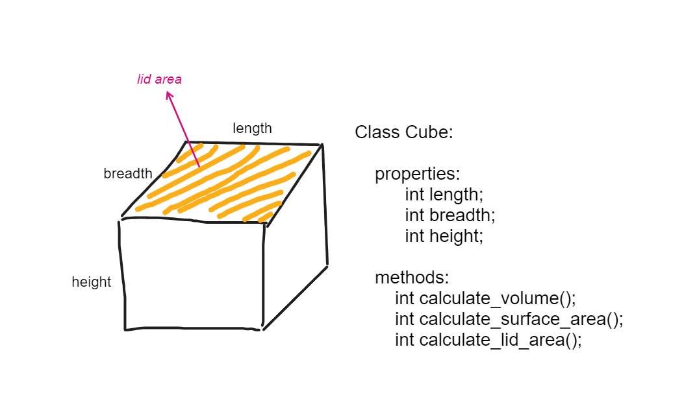

# OOP

Playlist Link I referenced: https://www.youtube.com/watch?v=ZDa-Z5JzLYM&list=PL-osiE80TeTsqhIuOqKhwlXsIBIdSeYtc

Additional Notes from: https://udemy.com/course/learn-python-with-abdul-bari

## Why OOP?
- OOP is a paradigm with its own set of (core) principles, namely:
    - Encapsulation : combining all the related things together and keeping them compartmentalized in "capsules".
    - Abstraction : allowing for simplicity by showing only what is required to the programmer and hiding the redundant internal implementation details. We can achieve abstraction with the help of encapsulation.
    - Inheritance : can borrow all features from existing classes and just add the new features as needed.
    - Polymorphism : one name, different actions. Single name used, but used to perform different actions.

- In OOP, everything is an object, which could be tangible or intangible (e.g. student, car, purchase, order, movie, washing machine).

- An object is defined using **properties** (which are variables) and **methods** (functions/operations which the object can perform). 

## Classes and Object
- Is a blueprint for creating instances (objects), sort of making a "design of the object".

- There is a class for every object. _example class shown below_



- All methods which are accessing properties of the initialized object need to take `self` as an argument, which is a reference to the current object.

- Instance variables create data unique to each instance (set using `self.<variable_name>`).
```python
class Employee:
    def __init__(self, firstName, lastName, pay):
        self.firstName = firstName
        self.lastName = lastName
        self.pay = pay
        self.email = f'{self.firstName}@{self.lastName}.io'

emp1 = Employee("Hohn", "Jammy", 500000) 
```

- Creation of instance variables can be done, refer to [this](./3_instance_var_methods.ipynb): 
    - using the constructor/the `__init__()`
    - inside instance methods (need to call the instance method for creation)
    - outside the class itself
```python
class Car:
    def __init__(self):
        self.var1 = 10

    def updateVars(self):
        self.var2 = "Cat"

car1 = Car()
car1.updateVars() # call method to create instance var
print(dir(car1))
```

- can override class variables by overriding in main method. An example of an instance method in this case is applyRaise()
```python
class Employee:
    raiseAmount = 200
    def __init__(self, firstName, lastName, pay):
        self.firstName = firstName
        self.lastName = lastName
        self.pay = pay
        self.email = f'{self.firstName}@{self.lastName}.io'

def applyRaise(self):
    self.pay += self.raiseAmount # instance raiseAmount -> affects only the single instance


emp1 = ...
emp2 = ...

emp1.raiseAmount = 150
print(emp1.raiseAmount) #150
print(emp2.raiseAmount) #200
```

### Sub-Classes/Child Classes
- Method Resolution Order: _Current class `ChildClass` -> Parent of current class `ParentClass` -> the base object `builtin.objects`._

- inherit properties and methods from parent class

```python
def ParentClass:
    # methods, class variables and properties
    pass


def ChildClass(ParentClass):
    # new properties (if any)
    pass
```

## Methods
>_- Basic definition: functions associated with a class_

### Regular Methods
- take the instance (`self`) as the first argument.

### Class Methods
- takes the class (`cls`) as the first argument. 
    - by convention as `class` is a python reserved keyword
- peforms modification operations on class variables

### Static Methods
- Have a logic connection to the parent class, but not depend on any specific instance or class variable.
- Determining to write a static method: don't access the instance or the class anywhere within the target function.

## Special Methods (`__init__`, `__repr__` and `__str__`)

- Allows us to change how objects are printed and displayed.

- Sample definition of both these methods are as follows:

```python
# unambiguous representation of object -> meant for other devs to see
def __repr__(self):
    pass

# to-string method
def __str__(self):
    pass
```

- We need to at least have a dunder repr (`__repr__`) method before having the dunder string (`__str__`) method as `__repr__` will be the fallback in the case of no dunder string defined.

 - `__repr__` is how you would create a new method using the constructor.

### Decorators for OOP
- The `@property` decorator is like `getters` and `setters` in other languages. Allows one to define a method but access it as if it is an attribute.

```python
@property   # property decorator
def do_something():
    pass
```

---

## Notes
- Feel free to use `4_test.csv` for data reading (Option 8 in `4_class_vars.py`).
- Chores: 
    - [ ] validate csv options using file/directory whitelist
    - [ ] add classVar count for `4_entireClassofMethods.py`.