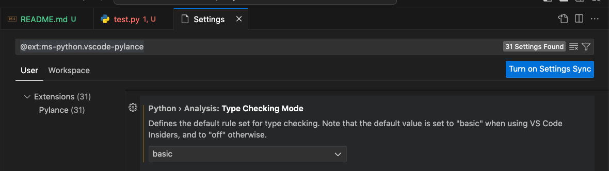

# Type Annotations

- Simply put, is just a hint that tells us what type a variable is.
```python
text : str = "Hello, World!"
text2 : int = "Hi there!" # error
```
- Need to configure `Pylance` extension to support type hinting.
